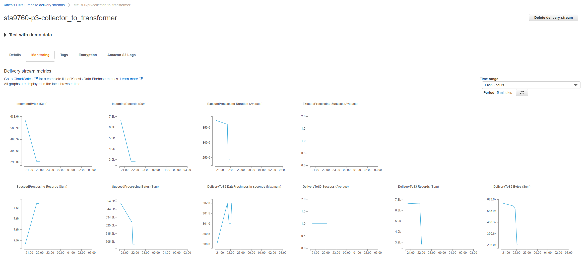

# sta9760-project3

This project is meant to utilize AWS lambda, kinesis, glue, athena and S3 to create a on-demand live stream of stock data from the yfinance package. dataCollector.py is the code for a lambda function that collects and streams data to a AWS firehose. dataTransformer, in this case , mostly takes care of the line-breaks in the data to be then loaded to a S3 bucket. 
A AWS glue crawler is applied on the data to build metadata and extract a schema, which can later be queried through AWS athena.

data collector api : https://cvbyv911bf.execute-api.us-east-2.amazonaws.com/default/DataCollector

