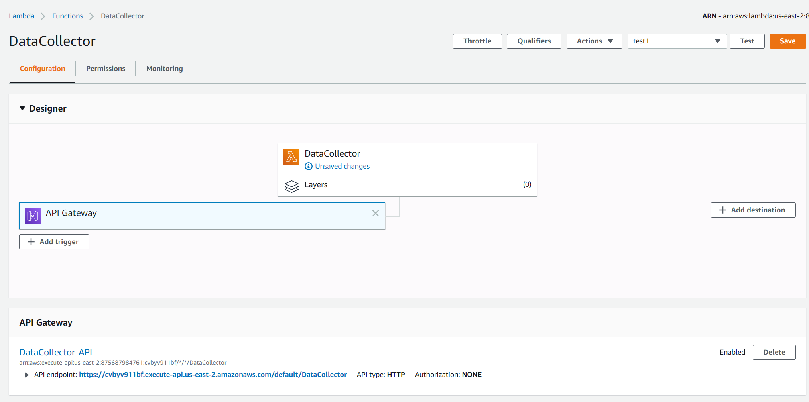

# sta9760-project3 
## AWS pipeline with live stock data using yfinance 

This project is meant to utilize AWS lambda, kinesis, glue, athena and S3 to create a on-demand live stream of stock data from the yfinance package (documentation available at https://pypi.org/project/yfinance/). 
DataCollector.py is the code for a lambda function that collects and streams data to a AWS firehose. Inside the firehose a second lambda function is refernced which basically formats all data sent through the firehose to a simple one-per-line format. Data is loaded into an S3 bucket and a glue crawler is applied on the data to build metadata and extract a schema which can later be queried through AWS athena.
 
the data collected in this example is for 10 different stocks, for the day of 5/14/2020 in a 1 minute interval. 
 
query.sql is a simple example query to show top hourly rates per stock , results in results.csv

inside finance_data is a json file with an example of what the data that eventually lands in the S3 bucket looks like. this is the data upon which the crawler is used and later queried using Athena

data collector api : https://cvbyv911bf.execute-api.us-east-2.amazonaws.com/default/DataCollector

